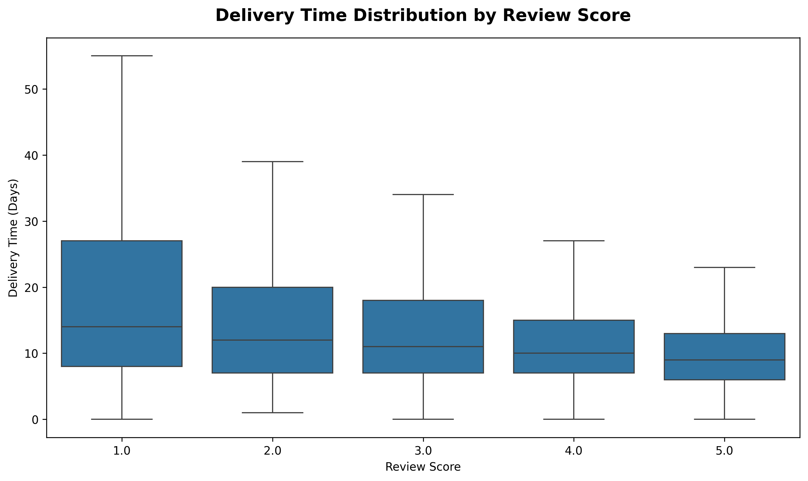
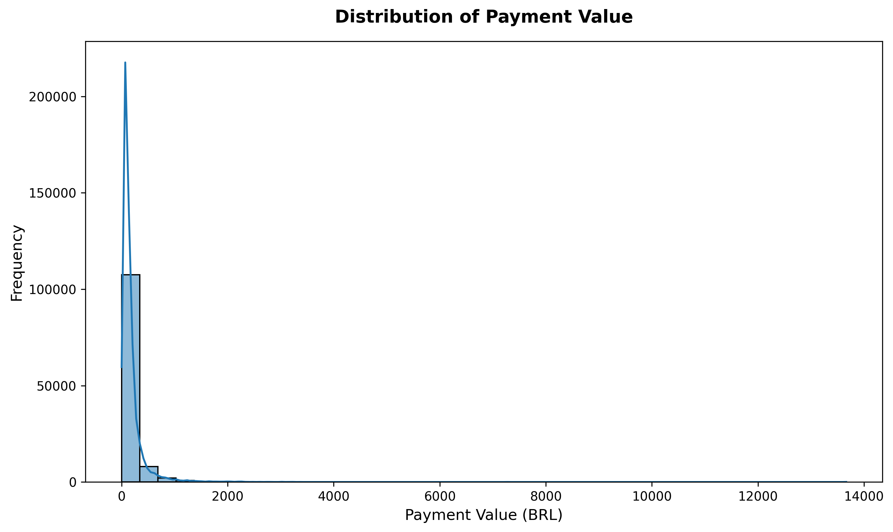
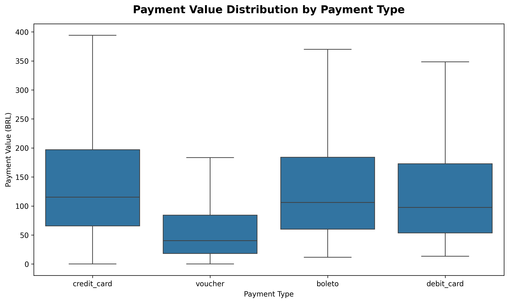
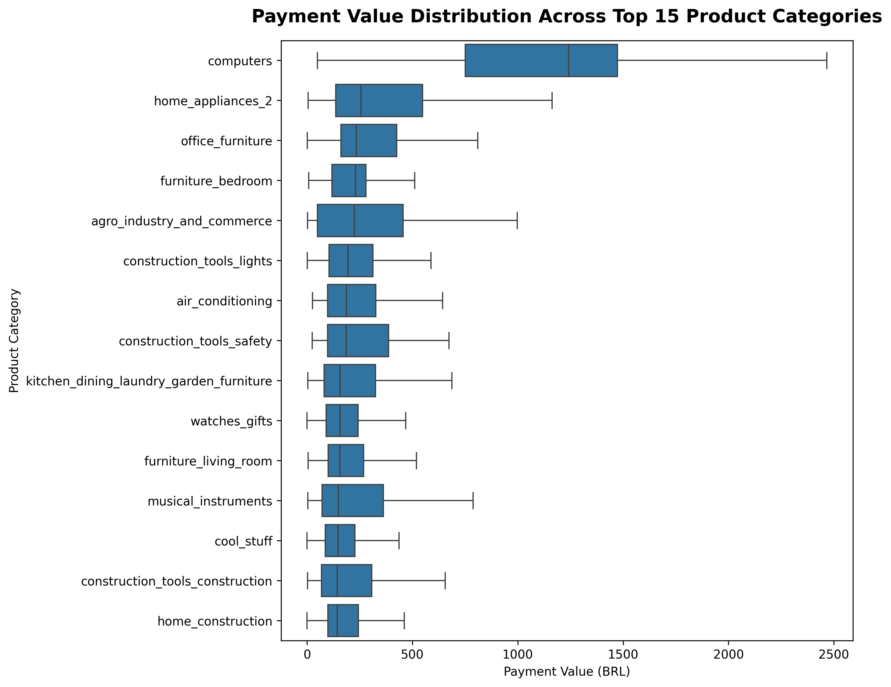
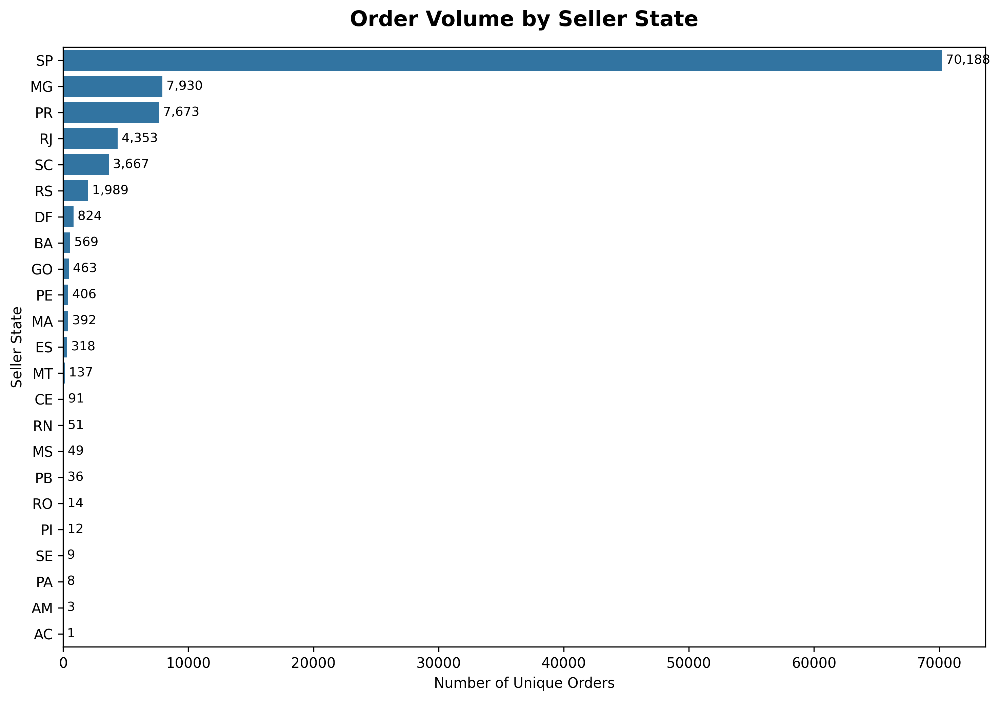

# 📊 Statistical Analysis of Brazilian E-Commerce Data


## 📌 Project Overview

This project performs an end-to-end statistical analysis of the **Brazilian E-Commerce Public Dataset by Olist**.

The analysis focuses on understanding:

- Customer purchasing behavior
- Payment patterns
- Delivery performance
- Product categories
- Seller performance
- Freight costs
- Customer satisfaction

The project combines **data cleaning, exploratory data analysis, descriptive statistics, statistical testing, and business interpretation** to transform raw transactional data into actionable business insights.

---

## 🎯 Business Problem

Olist is a major Brazilian e-commerce marketplace with data distributed across multiple relational datasets.

The objective of this project is to understand customer purchasing behavior, payment preferences, delivery performance, and factors associated with customer satisfaction.

The analysis also aims to identify statistically significant relationships and differences that can support data-driven business decisions.

---

## 🎯 Project Objectives

- Import and understand multiple datasets
- Perform data cleaning and preprocessing
- Merge relational datasets
- Conduct Exploratory Data Analysis (EDA)
- Apply descriptive statistics
- Analyze relationships between important variables
- Perform hypothesis testing
- Identify statistically significant relationships and group differences
- Translate statistical findings into business recommendations

---

## 📓 Project Notebook

[View the Complete Statistical Analysis Notebook](notebook/Statistical_Analysis.ipynb)

---

# 📂 Dataset

The project uses the **Brazilian E-Commerce Public Dataset by Olist**.

The dataset contains multiple related CSV files representing different aspects of the e-commerce business.

### Main Datasets

| Dataset | Description |
|---|---|
| Customers | Customer location details |
| Orders | Order status and timestamps |
| Order Items | Products purchased in each order |
| Payments | Payment methods, installments, and payment values |
| Products | Product information |
| Reviews | Customer review scores |
| Sellers | Seller information |
| Product Category Translation | Portuguese-to-English product category translation |
| Geolocation | Brazilian geographic information |

The datasets are related through identifiers such as:

`order_id`, `customer_id`, `product_id`, and `seller_id`.

---

# 🧹 Data Cleaning & Preprocessing

The project includes extensive data-quality checks before analysis.

### Key Data Cleaning Activities

- Missing-value assessment
- Duplicate-record checks
- Data-type validation and conversion
- Text standardization
- Primary-key validation
- Foreign-key validation
- Investigation of unmatched product IDs
- Investigation of missing product-category translations
- Handling of missing values based on dataset context
- Validation of relationships after cleaning

Special attention was given to **relational integrity** before merging the datasets.

---

# 🔗 Dataset Integration

The individual Olist datasets were integrated into a final analytical dataset.

### Major Relationships

```text
Customers
    │
    │ customer_id
    ▼
Orders
    │
    ├── order_id ───────────────► Payments
    │
    ├── order_id ───────────────► Reviews
    │
    └── order_id
          │
          ▼
     Order Items
          │
          ├── product_id ──────► Products
          │                         │
          │                         │ product_category_name
          │                         ▼
          │                Product Category Translation
          │
          └── seller_id ────────► Sellers

```

The merge process was validated at multiple stages to identify:

- Missing records
- Unmatched keys
- One-to-many relationships
- Relational inconsistencies

---

# 📈 Exploratory Data Analysis

The EDA was conducted at three levels.

## 1. Univariate Analysis

The distributions and characteristics of individual variables were examined, including:

- Review Score
- Payment Value
- Freight Value
- Product Category
- Order Status
- Seller State
- Payment Type
- Product Weight

---

## 2. Bivariate Analysis

Relationships between important business variables were explored, including:

- Payment Value vs Review Score
- Freight Value vs Product Weight
- Product Category vs Review Score
- Product Category vs Payment Value
- Seller State vs Order Volume
- Payment Type vs Payment Value
- Payment Installments vs Payment Value
- Review Score vs Delivery Time

---

## 3. Multivariate Analysis

Multiple variables were analyzed together to understand more complex business patterns, including:

- Payment Value vs Review Score vs Payment Type
- Delivery Time vs Review Score vs Seller State
- Payment Value vs Installments vs Payment Type
- Product Category vs Payment Value vs Review Score

---

# 📊 Descriptive Statistics

Descriptive statistics were used to understand the distribution, central tendency, spread, and outliers of important numerical variables.

For example, payment value showed a strongly right-skewed distribution with substantial variation between typical transactions and high-value purchases.

The analysis examined:

- Mean
- Median
- Standard deviation
- Minimum and maximum
- Quartiles
- Distribution shape
- Outliers

This helped establish the statistical context before hypothesis testing.

---

# 🧪 Statistical Analysis

The statistical analysis was performed after completing the EDA to determine whether important observed patterns were statistically significant.

### Significance Level

**α = 0.05**

### Decision Rule

- **p-value < 0.05** → Reject H₀
- **p-value ≥ 0.05** → Fail to reject H₀

### Statistical Tests Used

| Test | Purpose |
|---|---|
| Spearman Rank Correlation | Measure the direction and strength of monotonic relationships |
| Pearson Correlation | Measure linear association between numerical variables during EDA |
| Kruskal-Wallis H Test | Compare a numerical variable across three or more independent groups |
| Dunn's Post-hoc Test | Identify specific group pairs after a significant Kruskal-Wallis result |
| Bonferroni Correction | Adjust p-values for multiple pairwise comparisons |

Non-parametric tests were used where the data did not necessarily satisfy the assumptions required for parametric tests.

---

# 🔬 Hypothesis Testing Results

## 1. Delivery Time vs Review Score

**Test:** Spearman Rank Correlation

| Metric | Result |
|---|---:|
| Correlation coefficient | **-0.220** |
| P-value | **< 0.001** |
| α | **0.05** |
| Decision | **Reject H₀** |

### Finding

There is a **statistically significant negative relationship** between delivery time and customer review score.

Longer delivery times tend to be associated with lower review scores.

However, the correlation is relatively weak, indicating that delivery time is only one of several factors influencing customer satisfaction.

---

## 2. Payment Value vs Number of Installments

**Test:** Spearman Rank Correlation

| Metric | Result |
|---|---:|
| Correlation coefficient | **0.395** |
| P-value | **< 0.001** |
| α | **0.05** |
| Decision | **Reject H₀** |

### Finding

There is a **statistically significant positive relationship** between payment value and installment count.

Higher payment values tend to be associated with a higher number of installments.

The relationship is moderate in strength.

> **Important:** Correlation indicates association, not causation. The analysis does not prove that installments cause customers to spend more.

---

## 3. Payment Value vs Payment Type

**Test:** Kruskal-Wallis H Test

| Metric | Result |
|---|---:|
| Kruskal-Wallis statistic | **6335.05** |
| P-value | **< 0.001** |
| α | **0.05** |
| Decision | **Reject H₀** |

### Finding

Payment values differ **significantly across payment types**.

Because the Kruskal-Wallis test only establishes that at least one group differs, a **Dunn's post-hoc test with Bonferroni correction** was performed.

### Post-hoc Finding

All pairwise comparisons between payment types were statistically significant after Bonferroni correction:

- `boleto` vs `credit_card`
- `boleto` vs `debit_card`
- `boleto` vs `voucher`
- `credit_card` vs `debit_card`
- `credit_card` vs `voucher`
- `debit_card` vs `voucher`

All adjusted p-values were **< 0.001**.

---

## 4. Payment Value vs Product Category

**Test:** Kruskal-Wallis H Test

| Metric | Result |
|---|---:|
| Kruskal-Wallis statistic | **10876.52** |
| P-value | **< 0.001** |
| α | **0.05** |
| Decision | **Reject H₀** |

### Finding

Payment values differ **significantly across product categories**.

A Dunn's post-hoc test with Bonferroni correction was then used to identify specific category-level differences.

There were:

- **73 product categories**
- **2,628 possible pairwise comparisons**
- **1,212 statistically significant pairwise comparisons**

This demonstrates substantial variation in payment-value distributions across product categories.

---

# 📌 Statistical Analysis Summary

| Business Question | Statistical Test | Main Result |
|---|---|---|
| Delivery Time vs Review Score | Spearman Correlation | Significant negative relationship |
| Payment Value vs Installments | Spearman Correlation | Significant positive relationship |
| Payment Value vs Payment Type | Kruskal-Wallis | Significant group differences |
| Payment Value vs Product Category | Kruskal-Wallis | Significant group differences |

---

## 📊 Overall Statistical Findings

The analysis provides statistical evidence that:

1. **Longer delivery times are significantly associated with lower review scores.**
2. **Higher payment values are significantly associated with higher installment counts.**
3. **Payment values differ significantly across payment types.**
4. **Payment values differ significantly across product categories.**
5. **Many product-category pairs show statistically significant differences in payment-value distributions.**

> **Note:** Statistical significance does not necessarily mean that an effect is large or practically important. Business decisions should consider both statistical evidence and the magnitude and context of the observed effect.

---

# 🖼️ Key Visualizations

The following visualizations highlight the major statistical and business findings from the analysis.

## 1. Delivery Time vs Review Score

This visualization illustrates the relationship between delivery time and customer review scores.



**Insight:** Longer delivery times are significantly associated with lower review scores.

---

## 2. Payment Value Distribution

This visualization shows the distribution of payment values and highlights the variation and skewness in customer transaction values.



**Insight:** Payment values show a right-skewed distribution, with most transactions concentrated at lower values and a smaller number of high-value transactions.

---

## 3. Payment Type vs Payment Value

This visualization compares payment values across different payment methods.



**Statistical Finding:** Payment values differ significantly across payment types based on the Kruskal-Wallis H test.

---

## 4. Product Category vs Payment Value

This visualization compares payment values across product categories.



**Statistical Finding:** Payment values differ significantly across product categories based on the Kruskal-Wallis H test.

---

## 5. Business-Oriented Visualization

Seller-state order volume provides a business-oriented view of regional performance and helps identify markets with higher levels of customer activity.



**Business Insight:** Regional differences in order volume can help identify high-demand markets and support decisions related to logistics, seller performance, and regional strategy.
---

# 💡 Business Recommendations

The statistical findings were translated into practical business recommendations.

## 1. Improve Delivery Performance

Monitor sellers, regions, and delivery routes where delivery times are consistently high.

**Potential impact:** Better delivery performance may improve customer satisfaction and reduce negative reviews.

---

## 2. Monitor High-Value Customer Transactions

Identify high-value orders and customer segments for targeted strategies such as:

- Personalized offers
- Cross-selling
- Product recommendations
- Loyalty programs

---

## 3. Optimize Freight Costs

Analyze freight costs by:

- State
- Seller
- Product category
- Delivery characteristics

Investigate unusually high shipping costs and identify opportunities for logistics optimization.

---

## 4. Improve Underperforming Product Categories

Identify categories combining:

- Low sales
- Lower review scores
- Longer delivery times
- Higher freight costs

Further investigation can focus on:

- Product quality
- Pricing
- Seller performance
- Customer expectations

---

## 5. Monitor Regional Performance

Order volume and sales vary across Brazilian states.

Use regional analysis to identify:

- High-demand markets
- Underpenetrated regions
- Areas with high logistics costs
- Areas with longer delivery times

---

## 6. Monitor Seller Performance

Develop seller-performance metrics based on:

- Average review score
- Delivery time
- Order volume
- Revenue
- Delivery delays

---

## 7. Maintain Flexible Payment Options

The significant relationship between payment value and installment count, together with differences across payment types, highlights the importance of understanding customer payment behavior.

Flexible payment options may help reduce purchase barriers, particularly for higher-value transactions.

---

# 🖼️ Selected Visualizations

The repository contains visualizations generated during the analysis.

Examples include:

- Review score distribution
- Payment value distribution and boxplot
- Freight value distribution
- Delivery time vs review score
- Seller-state distribution
- Top product categories
- Payment type analysis
- Product weight analysis

Visualizations are available in the [`images`](./images) directory.

---

# 📁 Project Structure

```text
Brazilian-Ecommerce-Statistical-Analysis/
│
├── data/
│   ├── olist_customers_dataset.csv
│   ├── olist_geolocation_dataset.csv
│   ├── olist_order_items_dataset.csv
│   ├── olist_order_payments_dataset.csv
│   ├── olist_order_reviews_dataset.csv
│   ├── olist_orders_dataset.csv
│   ├── olist_products_dataset.csv
│   ├── olist_sellers_dataset.csv
│   └── product_category_name_translation.csv
│
├── images/
│   └── [analysis visualizations]
│
├── notebook/
│   └── Statistical_Analysis.ipynb
│
├── .gitignore
├── LICENSE
├── README.md
└── requirements.txt
```

---

# ▶️ How to Run the Project

Follow the steps below to run the analysis locally.

## 1. Clone the Repository

```bash
git clone https://github.com/aysharafiya11/Brazilian-Ecommerce-Statistical-Analysis.git
```

## 2. Navigate to the Project Directory

```bash
cd Brazilian-Ecommerce-Statistical-Analysis
```

## 3. Install the Required Libraries

```bash
pip install -r requirements.txt
```

## 4. Launch Jupyter Notebook

```bash
jupyter notebook
```

## 5. Open the Notebook

Navigate to:

`notebook/Statistical_Analysis.ipynb`

Run the notebook cells sequentially to reproduce the analysis.

---

# 🛠️ Tools & Technologies

- Python
- Pandas
- NumPy
- Matplotlib
- Seaborn
- SciPy
- Scikit-posthocs
- Jupyter Notebook

---

# 📋 Key Skills Demonstrated

This project demonstrates practical experience in:

- Python for Data Analysis
- Pandas
- NumPy
- Data Cleaning
- Data Validation
- Data Integration
- Relational Dataset Merging
- Exploratory Data Analysis
- Descriptive Statistics
- Data Visualization
- Correlation Analysis
- Hypothesis Testing
- Non-parametric Statistical Testing
- Kruskal-Wallis Test
- Spearman Correlation
- Dunn's Post-hoc Analysis
- Bonferroni Correction
- Statistical Interpretation
- Business Insight Generation
- Data-driven Recommendations

---

# 🏁 Final Conclusion

This project demonstrates a complete analytical workflow using a real-world Brazilian e-commerce dataset.

The analysis moves beyond simple visualization and descriptive summaries by applying statistical methods to evaluate whether important observed relationships and differences are statistically significant.

The major findings highlight significant associations involving:

- **Delivery performance and customer satisfaction**
- **Payment value and installment behavior**
- **Payment value and payment type**
- **Payment value and product category**

These findings were translated into recommendations covering:

- Logistics
- Customer satisfaction
- Freight optimization
- Seller performance
- Regional strategy
- Product categories
- Payment behavior

### 🔑 Key Takeaway

> **Effective data analytics goes beyond finding patterns. The real value comes from converting those patterns into statistically supported insights and actionable business decisions.**

---

## 👤 Author

**Aysha Rafiya**

Data Analytics Portfolio Project
